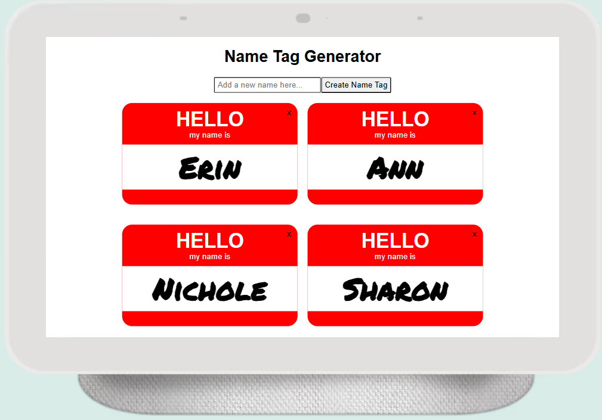

# 🎟️ Name Tag Generator

A fun, lightweight React app that lets users create and store personalized name tags using modern React Hooks and local storage.

## 🚀 Features
- **Dynamic name input** with real-time preview
- **Local storage** support to persist tags between sessions
- **Clean, responsive UI** built with simplicity in mind
- **Reusable components** following React best practices

## 🧠 Technologies
- React (Hooks)
- JavaScript (ES6+)
- Local Storage API
- CSS

## 📸 Demo


## 🛠️ Getting Started

Clone the repo and start the project locally:

```bash
git clone https://github.com/CreatedByCC/name-tag-generator-hooks.git
cd name-tag-generator-hooks
npm install
npm start
